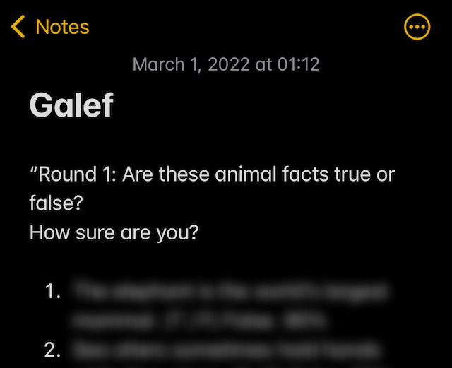
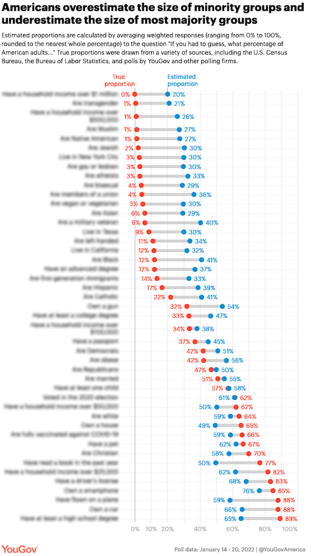
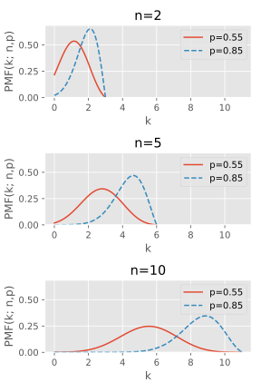

Table of contents—
- [Introduction](#introduction)
- [The game](#the-game)
- [Future directions: proportions](#future-directions-proportions)
- [Appendix: math](#appendix-math)
- [Appendix: ObservableHQ Plot](#appendix-observablehq-plot)
- [Appendix: React and Redux](#appendix-react-and-redux)
- [Appendix: Twitter backup](#appendix-twitter-backup)

## Introduction

On Dan Luu’s [ringing endorsement](https://nitter.eu/danluu/status/1477789639423320064) ([original](https://twitter.com/danluu/status/1477789639423320064)), I rushed to buy [Julia Galef](https://nitter.eu/juliagalef)’s _The Scout Mindset_. And I **loved** it.

I often talk about things in terms of “completeness”, like in the sense of arguments that are “incomplete” because it omitted considerations that could have materially changed its result. I didn’t enjoy my lengthy stint in grad school but I’m grateful for having it drum into me the central importance of completeness, and I often have wished it was more widely talked about. Yes, you of course have to publish an analysis sometime and it will never be completely complete, but you
1. ruthlessly prioritize finding flaws and omissions in your work during the time you spend on it,
2. you have a low threshold for canceling publication if you find anything serious, and
3. are frank and open about discussing the flaws you do find and didn’t address (“future work”).

And for years I’d thought that this level of self-criticism was just a legacy of the academy, but no, here comes Galef and says, “Everyone could be like that! And here’s why and how!” 💋👌

## The game

So there’s a delightful game in chapter six, “How sure are you?”, where you attempt to calibrate your uncertainty through a quick series of trivia questions:

> As you go through the list, you should notice your level of certainty fluctuating. Some questions might feel easy, and you’ll be near certain of the answer. Others may prompt you to throw up your hands and say, ‘I have no idea!’ That’s perfectly fine. Remember, the goal isn’t to know as much as possible. It’s to know how much you know.

This is like _catnip_ to me—ever since reading _Fooled by Randomness_ when it came out in 2002, then studying statistical signal processing, and eventually joining the finance industry, I’ve thought about the challenges and rewards of skill in converting uncertainty into action. So I was reading this literally in the middle of the night in bed on my phone, so I… copied the text of the fourty questions from the ebook into my phone’s Notes app, answered the questions, and manually tallied my score:



I knew I wanted friends to try this, so I made a web app version, called Devastate: https://fasiha.github.io/devastate/ and it this is what it looks like:


Same story as the book: you answer fourty trivia questions, picking your uncertainty surrounding each, and the app will spit out a graph with five dots—your expected versus actual uncertainty—plus a couple of confidence interval bands. You can share the URL with your friends: here’s the [link](https://fasiha.github.io/devastate/#v1-14101103111310011013141200041314041000020003010103001000041014021100141303140402) to my answers and results.

## Future directions: proportions

Soon after I made Devastate, this graph made the rounds, from the following YouGov study, [“From millionaires to Muslims, small subgroups of the population seem much larger to many Americans”](https://today.yougov.com/topics/politics/articles-reports/2022/03/15/americans-misestimate-small-subgroups-population):



You can instantly imagine Devastate handling this case too: instead of binary yes/no questions that you answer and record your uncertainty about, you could do the same with proportions between 0% and 100%. I haven’t yet found a great math nor UX way to handle the boolean-to-proportion generalization yet—if you have ideas, get [in touch](/#contact).

I’m 50% sure I’ll revisit this problem and figure it out within two years (75% within five years).

## Appendix: math

> This section is for the math fans, about how I draw those 50-percentile and 90-percentile, and why you might want to too.

Galef just sketches how to anchor your performance on this game: the fraction of questions you got correct within each confidence bucket should more or less match that confidence's probability. There's a way to make this quite rigorous, and as we'll see, that extra rigor is actually useful when it comes to interpeting your results.

So in statistics, there's a probability distribution called the binomial distribution. This is one of the first probability distributions described formally: Jacob Bernoulli described many of its properties in the late 1600s. It's traditionally described as the distribution that arises when you flip a `p`-weighted coin `n` times—that is, if you have a coin that comes up heads with probability `p` and you flip it `n` times in a row, how many times does it come up heads? We know it's between `0 <= k <= n`, and the binomial distribution assigns the probability to each `k` for given `p` and `n`.

This of course exactly matches our application. My friend Hatem answered five questions that he assigned 85% confidence to and got three of them right, for an actual frequency of 3/5=60%. If you have Python and Scipy, you can ask it for the binomial probability of him getting `k=0...5` right:
```py
from scipy.stats import binom as binomrv
for k in range(6):
  print(f'- Probability(k = {k}) = {binomrv.pmf(k, 5, 0.85):0.3f}')
```
And here's the output:
- Probability(k = 0) = 0.000
- Probability(k = 1) = 0.002
- Probability(k = 2) = 0.024
- Probability(k = 3) = 0.138 👈 Hatem's actual result
- Probability(k = 4) = 0.392 👈 higher probability
- Probability(k = 5) = 0.444 👈 *highest* probability!

We know that Hatem's empirical frequency of 3/5=60% is lower than the ideal of 85% (which is the confidence he assigned his answers to these five questions). This shows a surprising fact: in the ideal case, a perfectly-calibrated person who answered five questions with 85% confidence would get all five right, and get 5/5=100% frequency, *more often* than 4/5=80%, even though 80% is closer to 85% than 100%.

That surprised me!

Similarly, Hatem answered four questions with 55% confidence and got 3 of them right. So 75% actual frequency versus 55% confidence: seems pretty uncalibrated right? But Python says (`binomrv.pmf(3, 4, 0.55)`) this has probability 0.300, which is quite a bit higher, *almost double* the probability in the `k=3` bullet for the `n=5, p=0.85` case above, 0.138.

That is, answering 3/4=75% right at 55% confidence is much better calibrated than answering 3/5=60% at 85% confidence.

So it's clear that if we want to make sense of the five dots (our actual frequency of correctness vs our subjective probability) correctly, we could use some statistics. Specifically, we need to see *confidence intervals* for each of the five dots to tell us how well we did, for the actual number of `n` we answered for each confidence level.

> I'm using "confidence interval" as a technical phrase to refer to the probability concept desscribed below. I also use the word "confidence" to refer to the five subjective probabilities in Galef's book, 55%, 65%, 75%, 85%, and 95%, but the two usages are unrelated.

A `P`-percentile confidence interval (where `P` might be fifty, ninety, etc., some number between one and ninety-nine) is two numbers, call them `k1` and `k2`, such that
- `Probability(k1 <= k) = (100 - P / 2) / 100` and
- `Probability(k <= k2) = (100 + P / 2) / 100`

for a fixed `n` and `p`. That is, for the `P=50` percentile, there's a range of correct answers, `k1` to `k2`. For `P=75` or `P=90` confidence intervals, the bounds get steadily wider because *more* of the binomial distribution's weight is captured between those boundaries. If your `k` correct answers are within the fifty-percentile confidence interval, you're doing *better* than if your `k` is within the seventy-fifth percentile.

So the thing is…

While ordinarily confidence intervals are easy to calculate, *binomial* confidence intervals are iffy, because the binomial is a *discrete* distribution. It can tell you the probability of answering three (`k`) out of four (`n`) questions correctly if the probability of being correct is `p=0.55`, but when you ask it for which `k1` satisfies this equation: `Probability(k1 <= 3; n=3, p=0.55) = 0.25`, that is, what `k1` is at the twenty-fifth percentile of the distribution, it can only answer with an *integer*. Below we ask it for the fifth, twenty-fifth, seventy-fifth, and ninety-fifth percentile `k1`s:
```py
from scipy.stats import binom as binomrv
print(binomrv.ppf([0.05, 0.25, 0.75, 0.95], 4, .55))
# [1, 2, 3, 4]
```
and see that the standard binomial distribution's machinery just returns integers for the percent point function ([`ppf`](https://docs.scipy.org/doc/scipy/reference/generated/scipy.stats.binom.html), the inverse of the cumulative distribution function (CDF), i.e., percentiles).

Plotting these as confidence intervals is unappealing because these can *collapse* the bounds of confidence intervals in an unpleasant way. Consider this:
```py
print(binomrv.ppf([0.05, 0.25, 0.75, 0.95], 14, .95))
# [12, 13, 14, 14]
```
My friend Aubrey got correct all `k=14` of `n=14` questions she marked as 95% (`p=.95`), and Scipy can just give me the same number (14) for the seventy-fifth *and* ninety-fifth percentiles (these are the tops of the 50-percentile confidence interval and the 90-percentile confidence interval respectively). Is she closer to the fifty-percentile confidence interval or the nintety-percentile? This won't tell us.

So while the ordinary binomial distribution can certainly give us some confidence intervals, it'd be nice if we could find a *continuous* extension of the binomial distribution to help give us more aesthetically-pleasing confidence intervals.

There's this R package called [`cbinom`](https://rdrr.io/cran/cbinom/man/cbinom.html) that implements a [2013 paper](https://arxiv.org/abs/1303.5990) by Andreii Ilienko, but I didn't like how that construction results in a probability mass function (PMF) that's shifted from the ordinary binomial.

So I managed to construct my own continuous extension to the binomial distribution 😇 and it leverages the wonderful [mpmath](https://mpmath.org) library because I did not want to do any Real Math—quadrature integration for life! The details are in [`confidenceIntervals.py`](./math/confidenceIntervals.py), but here's the gist of it.

The standard binomial PMF can readily be extended to fractional `k`, up to a normalization factor, which we compute via numerical integration. So you still need a fixed integer `n >= 1` and fixed `0 <= p <= 1`, but now `k` is allowed to be real and `0 <= k <= n + 1`. Here's some example probability mass functions:



With the probability mass function readily implemented, we can compute the confidence intervals using mpmath's support for numerical quadrature integration and root finding. It's about as brute-force an approach as imaginable so there's no point in going on about it 🙃.

Then, since of course we don't want to be integrating things in JavaScript, I generate a bunch of relevant confidence intervals for the `p`, `n` and `k` values that are in our app, save them to JSON, and that's what the app uses.

## Appendix: ObservableHQ Plot

I used [ObservableHQ’s Plot](https://observablehq.com/@observablehq/plot) to make the graph, and I rather liked it! It’s by the same folks that made D3.js, Mike Bostock and crew, so you won’t be surprised by
- how cerebral the API is—very powerful, lots of reading the manual and lots of experimentation,
- elegant output out of the box—I sprinkled some CSS but the default SVG output is just gorgeous,
- the lack of TypeScript support—D3 has remained in this shrinking set of JavaScript projects that are not interested in TypeScript.

I get the same metallic taste in my mouth when I use D3 and Plot and any grammar-of-graphics library as when I used Clojure: very cool, very cerebral, very powerful—and very easy to split your lip and taste your blood. I often wonder if, just as I migrated away from Clojure’s beautiful data transforms to uglier and—for me—more productive static-typed ecosystems, I’ll ever fully leave D3’s sphere—Plotly is quite nice and I do like it, and in Python of course I’m very productive with the ugliest of them all (sorry Matplotlib).

## Appendix: React and Redux

Nothing special to report. Create-React-App. Redux Toolkit. The latest in React ecosystem tooling. “Go forth and be fruitful” tools—I like them.

## Appendix: Twitter backup

I have a pretty good system for backing up content I read online ([Yamanote](https://github.com/fasiha/yamanote)) but you might not so here’s an in-document backup: starting Jan 2, 2022, 23:51 PM UTC, @DanLuu tweets,
> I finally got around to reading Julia Galef's book on how to think clearly, Scout Mindset.
> 
> I liked it more than I expected to despite expecting to be highly biased towards liking it since it describes approaches I appreciate.
> 
>  One thing I really liked about it was that it suggests/summarizes actionable ways to check your own thinking, which I found useful even when it was discussing a way of thinking that I've had since I was a kid since I still mess up all the time and having concrete checks helps.
> 
>  Another is that it does a really good job of laying out the case for various ways of thinking. There are 6 blog posts that were on my to-do list that I think I don't need to write anymore since the book describes what I wanted to describe, but better than I would've done it.
> 
>  For example, a counter-argument to the idea that one needs to be hyper-optimistic and not acknowledge realistic probabilities of failure to be successful.
> 
> Julia's chapter on this uses a broader array of examples than I would've and is written to appeal to a wider audience, but, in appealing to a broader audience, the chapter doesn't sacrifice intellectual rigorousness.
>
> When that's possible, I view that as basically strictly better than how I write and I would write that way if I knew how in a time-efficient way.
>
> One thing I find amusing is that a lot of the negative reviews on Amazon seem to conflate having a difficult to read style with rigor and they knock the book for being unscientific or shallow because it's easy to read, like

---

(Banner: crop from [@bloomsberries’ Flickr](https://flic.kr/p/7LDp4): “balance scale: free trade v humans”. 2005 anti-WTO protest art in Victoria Park, Hong Kong)
