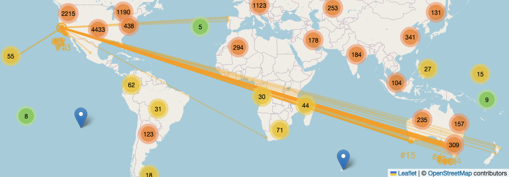
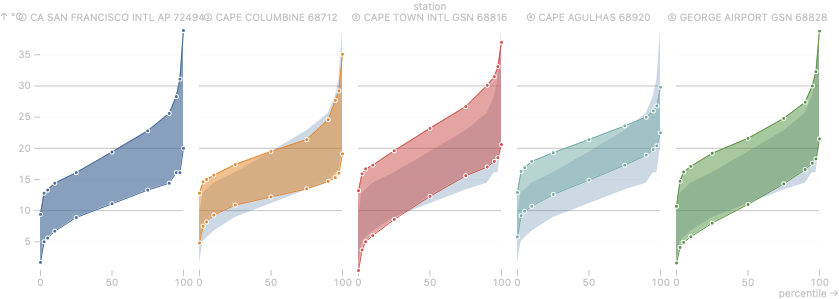
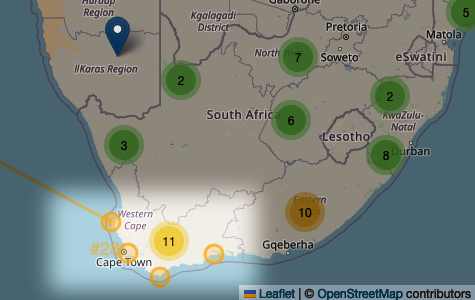
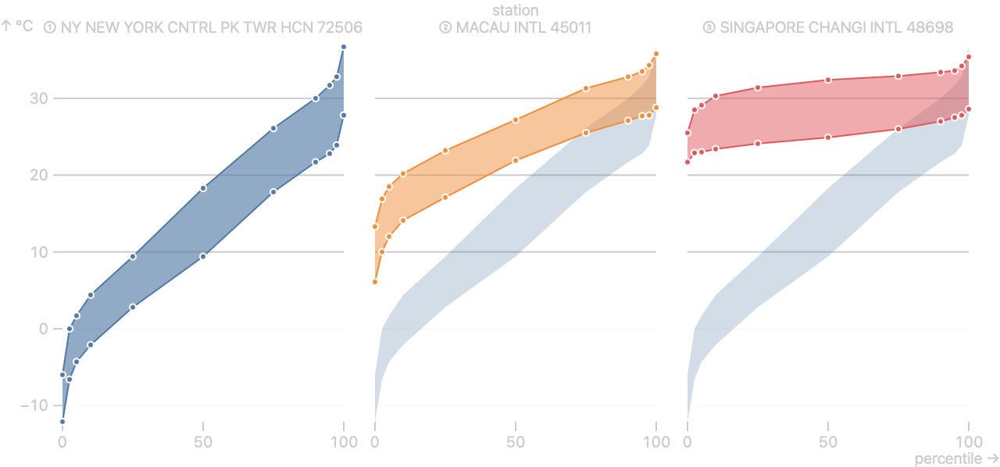

<link rel="stylesheet" type="text/css" href="here.css">

***tl;dr: check out my app [Hareonna](https://fasiha.github.io/hareonna)!***

I’ve lived in a few different regions of the world and thus have appreciated various climates over the years, but it wasn’t until we moved to California’s Bay Area, by San Francisco, that I got really curious about the universe of weather on the globe—because the Bay weather is *so* unique. It’s not usually warm, it doesn’t rain much, but the wind is always blowing and the fog is always rolling. Where else has this kind of weather? And what other kinds of climates are there that I don’t know about?

Wikipedia articles on cities tend to have tabular summaries of weather broken down by month, which I have often referred to, e.g., 

](./wiki-climate.png)

and this often answers some questions, about *this* city, but leaves me with more question about how this city compares to *others*.

So with all this in mind, I began working with the [GHCNd](https://www.ncei.noaa.gov/products/land-based-station/global-historical-climatology-network-daily) (Global Historical Climatology Network daily) database of weather station data, some of which goes back a hundred+ years. There’s *so* much you could do with this data but I want to skip to an app I wrote to visualize the temperature percentiles, *highs* and *lows*, for the ~13’500 weather stations with daily temperatures recorded for the last three years.

The web app is called [Hareonna](https://fasiha.github.io/hareonna) and it lets me make plots like this (tap/click or swipe/scroll right):

(Here’s the [direct URL for this view](https://fasiha.github.io/hareonna/#s:USW00023234,s:USW00013743,s:USW00014821,s:MYM00048674,s:IN022043500), which also shows the above data in a tabular form.)

This shows the temperature profiles at five weather stations close to where I’ve lived—
- Bay Area (SFO airport),
- the East Coast, Washington, DC area (IAD airport),
- the Midwest (CMH airport),
- coastal southeast Malaysia,
- coastal southeast India.

The two lines in each panel are highs and lows, with Celsius on the y-axis. The x-axis is interesting because it’s *percentiles*: a number between 0 and 100.
- 0%ile means the all-time minimum in the three-year data window,
- 10%ile means the temperature (high and low) is lower than this 10% of the time, 36 days, 5~ish weeks. Conversely, it’s higher than this the rest of the year.
- 50%ile is the median: the temperature (high and low) is less than this half the year and more than this half the year.
- 75%ile means the temperature (high and low) is less than this nine months of the year, i.e., greater than this three months of the year.
- 100%ile means the all-time maximum in the three-year data window.

So each line will always increase, but the two lines’ shape tends to fall in a few patterns.
- The East Coast and Midwest examples above are emblematic of much of the US: mostly parallel diagonal strips.
- A lot of the tropics is like the Malaysian and Indian examples: more horizontal than diagonal.
- The Bay Area is another archetype: a tilted tilde/wave dash 〜.

For ease of comparison, the app puts the first temperature profile underneath the rest of them. The three horizontal lines, at 10, 20, and 30 °C, are hardcoded also to facilitate comparison across different climates.

Because weather is so geographic, the app has a strong map component. You can see all 13’500 weather stations on an OpenStreetMap (clustered into groups based on zoom to avoid visual and computer overload), select one, and add it to the temperature percentile plot.

So. Where else has weather similar to San Francisco? Well, Hareonna can answer that question, in a simplistic way, by finding the weather stations with the most similar temperature percentiles. I picked the SFO station, and clicked the “Find similar” button three times to get this: a map with the sixty stations most similar to SFO, indicated by lines emanating from there:

> (You can ignore the red/orange/green circles with numbers in them: those are clusters of stations, and are unrelated to the lines connecting SFO to the most similar weather stations. And I implore you to forgive me my sin of using the Web Mercator projection 💩, there are some tech notes below where I explain myself 😭.)

And here are the fifteen most similar compared to the SFO airport station in the temperature percentile plot (again, tap/click or swipe/scroll right):

But this map above is most intriguing! I’d previously heard anecdotes that (a) New Zealand’s Cook Strait between the two big islands, and (2) northern Portugal both had that cool, wind, fog story that San Francisco has, and there’s certainly a lot of corroboration in this! However, some surprises:

Southern Australia, both southwest and especially the southeast, also have strong representation.

The western South African coast north of Cape Town is *also* quite similar to San Francisco temperatures—but not Cape Town itself! Here’s a look at San Francisco’s temperature percentile plot compared to four coastal South African stations ([direct link](https://fasiha.github.io/hareonna/#s:USW00023234,s:SF000068712,s:SFM00068816,s:SF000068920,s:SF000288380)):

Some like Cape Columbine and Cape Agulhas are similar to San Francisco in that they have that tilted 〜 tilde shape (especially Cape Agulhas might be attractive for those who find the Bay a bit too chilly?). Cape Town and George Airport are *thick* bands in the plots: Cape Town’s lows and highs at each percentile can vary 10 to almost 15 °C!

And if you click on “Find similar” for Cape Agulhas, the southernmost highlighted weather station in the map above, you get some truly diverse locations with similar weather: Los Angeles to Sydney, Peru to the eastern Atlantic!

---

Hareonna came in handy when a friend from New York City mentioned they were emigrating to Asia, and had offers in both Hong Kong and Singapore. After asking all the usual questions, I was curious about the weather change ([direct link](https://fasiha.github.io/hareonna/#s:USW00094728,s:MCM00045011,s:SNM00048698)):

🥵! Macau is the closest weather station to Hong Kong in the GHCNd database, just across the Pearl River Delta—less than two hours by bus. Macau/Hong Kong at least has three months of the year where the highs are less than 25 °C. Singapore of course is thoroughly tropical: it’s coolest high in the three years of data is 25 °C! Both are of course worlds away from Manhattan’s Central Park weather station (which is quite similar to both the Ohio and Washington DC weather stations we started with), the only similarities being the overlap at the very top-right of each plot.

I better not get used to San Francisco’s weather, where it exceeds 25 °C just *five weeks* of the year!

---

Something that I strongly appreciate having lived in the Bay Area for a while is how *local* weather can be. Climbing to the top of San Bruno Mountain ([OpenStreetMap](https://www.openstreetmap.org/node/358774522#map=13/37.6626/-122.4267) link), I can *see* the chilly fog enveloping Daly City to Richmond to downtown while the East Bay is sweltering in heat. I sometimes drive half-hour south to San Mateo’s wonderful East Asian restaurants and it’s distinctly *hot* compared to San Francisco. I drive another half-hour south to San Jose’s wonderful South Indian restaurants, and it’s *too* hot.

Why is that?

KQED has a story, [Why Does The Bay Area Have So Many Microclimates?](https://www.kqed.org/news/11827882/why-does-the-bay-area-have-so-many-microclimates), and it touches on a few factors important to the city proper, but I think it’s straightforward to generalize the physical and marine geography.

Here’s the Bay’s terrain, [texture-shaded](../texshade), superimposed on OpenStreetMap:

](./bay-600.jpg) HOVEROVERLAY(overlay.svg) simple

Long-press or hover over the above map to see my annotations but even without them, you may be able to see why South San Francisco, Daly City, and San Francisco proper all might be chilly, windy, and foggy, while areas south like San Mateo and definity by Palo Alto are warmer and drier: the Coastal Ranges that begin just south of Daly City put some ten kilometers of mountains between the Pacific and the cities along the Bay.

Here’s a [high-res 600 dpi render](./bay-600.jpg), which I hope you’ll take a look at: both are made from USGS’ delicious [NED ⅑″ topo-bathymetry](https://www.sciencebase.gov/catalog/item/581d2938e4b08da350d61140) of the Bay Area—one-ninth of an arcsecond is a pixel every *three* meters. Which is stunning: the widely used SRTM terrain dataset is a pixel every *thirty* meters (and is the data used by my [Texture-Shaded Globe](../texshade)).

> (My fellow GIS lovers: QGIS didn’t export PGW files for these layout renders, so bear with me: x min/max -122.543° to -121.938, y min/max 37.333° to 37.938°.)

---

[Hareonna](https://fasiha.github.io/hareonna) is very raw and young, and there are so many directions it could go in. What’s next? In no particular order:
- I’d love to be able to see a heatmap of areas of the globe that are more or less similar to a particular station.
- I’d absolutely love to see precipitation data, which is crucially important in California.
- Everything in the app is pre-computed (all the percentiles and weather station locations). But I’d like to be able to fetch the daily data from NOAA’s servers in the app to show a line graph of temperatures.
- I’d love to find a way to deal with the missing information in many of these.
- I’d like to integrate other data sources: GHCNd doesn’t have a single weather station in Taiwan. You can [check](https://www.ncei.noaa.gov/maps/); and, I’ve [asked for help](https://twitter.com/gratidue/status/1539320097189163009) ([Nitter URL](https://nitter.eu/gratidue/status/1539320097189163009)).
- More data in general. My phone’s weather app can show five cities’ real-time temperatures between San Francisco International airport and Redwood City: why are those not in GHCNd? Is that data proprietary?

I am quite pleased with the visualization technique created for Hareonna—the percentile highs and lows—not only because it lets me see some *objective* data that I couldn’t see before, but also because it lets me communicate something more subjective to others: the bars at 10, 20, and 30 °C, the superposition of all weather stations under the first one—these elements in the design let me subtly invite people to compare Place based on weather more seriously than they tend to. As my hero danah boyd said,

> Even if your data are nice and neat, the choices you make in producing a visualization of that data shape how those data will be perceived. You have the power to shape perception, whether you want to or not. There is no neutral visualization, just as there is no neutral data. Thus, in building your tools, you must account for your interlocutors. —danah boyd, [In the Pursuit of Knowledge, There Be Dragons](https://zephoria.medium.com/in-the-pursuit-of-knowledge-there-be-dragons-3a0155a5b6b4) (2021)

So I’m also curious about how the temperature percentile visualization could be improved, and if it can be integrated into other meteorological data.

---

A few tech notes follow.

At the insistence of NoScript-loving friends on social media, I finally investigated React.js’ server-side rendering (SSR), via Next.js, and built Hareonna with that. Verdict: 10/10, will build every app in the foreseeable future with Next. But Next and pnpm and even React are really power-tools: I had to use some fairly intricate JavaScript magic to get these to play nicely with all parts of the app, so I’m a bit wary of recommending it to beginner web developers. Specifically, it was not straightforward to integrate with Leaflet, which is the library that does all the mapping.

Leaflet: ✅. Yes, Web Mercator is 💩, and in an ideal world, I’d have used D3’s [orthographic projection](https://observablehq.com/@d3/world-tour) or [Cesium.js](https://sandcastle.cesium.com/)’ WebGL globe, but Leaflet’s API and ecosystem, along with OpenStreetMap, made it straightforward to go from idea in my head to app in my hands, and that cannot be overstated. In Joseph Gentle’s breaking down of coders into [three tribes](https://josephg.com/blog/3-tribes/), makers, hackers, and poets, I very much see myself first and foremost as a **maker**, but with a weakness of absent-mindedly accidentally writing code I didn’t want to write. Thus, I hugely value Jamie Brandon’s memorable phrasing:

> *If you have a mountain of shit to move, how much time should you spend looking for a bigger shovel?* There's no obviously correct answer—it must depend on the size of the mountain, the availability of large shovels, how quickly you have to move it etc. *But the answer absolutely cannot be 100% of your time.* **At some point you have to shovel some shit.** —Jamie Brandon, [Things Unlearned](https://www.scattered-thoughts.net/writing/things-unlearned/)

Leaflet is a solid grimoire for the code magician: Sarah Drasner recently [tweeted](https://twitter.com/sarah_edo/status/1544518772702121984) ([Nitter alternative](https://nitter.eu/sarah_edo/status/1544518772702121984)):

> I will never get over the magic of programming: 3 days ago I had an idea, and now I have a useful, functioning app.

Hareonna also uses [OpenStreetMap’s Nominatim](https://nominatim.openstreetmap.org/ui/search.html) API for converting user-provided locations to lat/lon coordinates to zoom into. I love OpenStreetMap—what a monumental achievement!

Finally, I’d like to note that GHCNd is a good candidate for developers looking for code katas in data munging with a large web-based database. If someone’s interested in using GHCNd as part of their interview, or just in formalizing a sequence of katas based on the database, [get in touch](/#contact)!

---

(Banner: crop from [David Yu’s Flickr](https://flic.kr/p/2kJTcaM): “Pouring Rain”, San Francisco, 2021)
