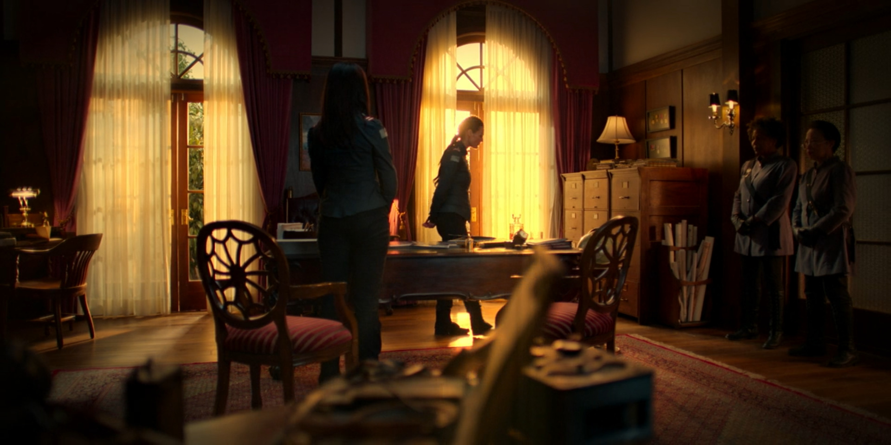
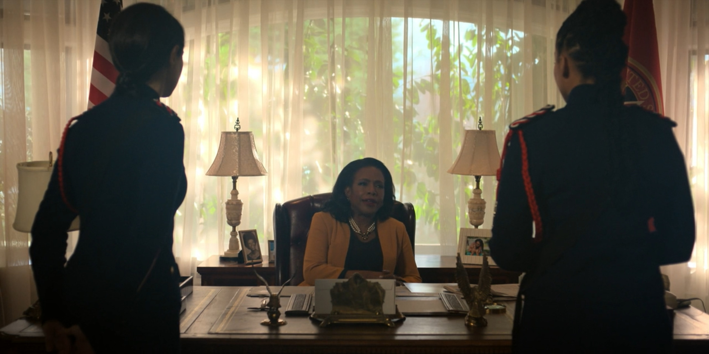
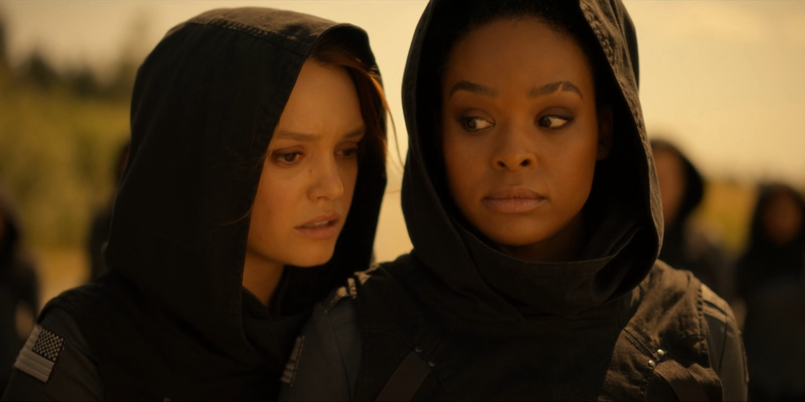
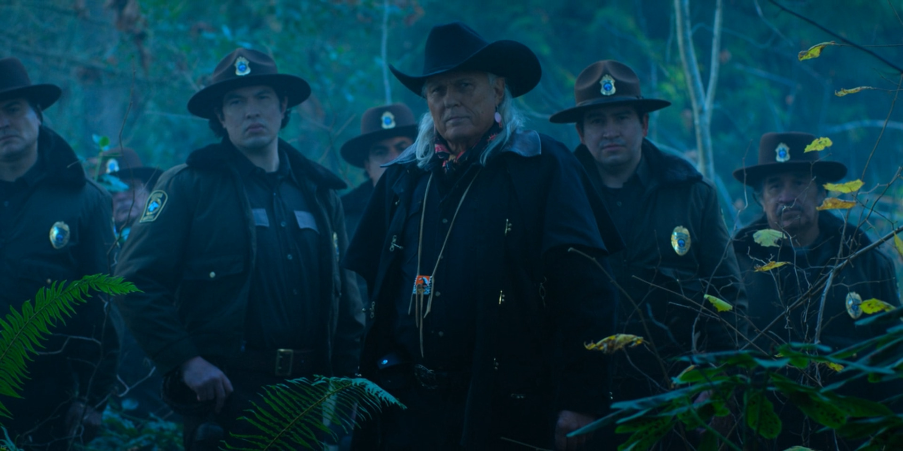

> (Banner above is from [IMDB](https://www.imdb.com/title/tt9900092/mediaviewer/rm835827713/): cropped headshots of Demetria McKinney, Amalia Holm, Taylor Hickson, Ashley Nicole Williams, Jessica Sutton, and Lyne Renée.)

Every time I got done watching episodes of *Motherland: Fort Salem* ([IMDB](https://www.imdb.com/title/tt9900092/), [Amazon](https://www.amazon.com/gp/video/detail/B08619SCY8)), in addition to the “Oh my gosh I love this show”, I also inevitably had this powerful sense of painful disappointment as I left that world and returned to our real world.

That world was dominated by powerful women—presidents, generals, soldiers, teachers, scientists. Our world marginalizes them. Blackness is triumphantly visible everywhere there. Our world seeks to render it invisible. Gay couples thrive there. They are under attack here.

There *are* problems in that world but it was incredibly delightful to trade, for a few hours at a time, this world’s problems for that world’s. To see endless conversations between women about every topic, raining like a soothing balm upon my parched Bechdel-test-failing media landscape. To the extent that, returning to the grotesque petty marginalization of our world ​*hurt*​.

This reminds me of the quote about Octavia Butler’s incredible oeuvre that instantly sent me scurrying to the library to read her. The reviewer noted how—white men were so decentered in Butler’s novels that they ​*aren’t even bad guys*​. Seeing the eponymous magic military school, and snapshots of a global power structure, consciously composed entirely of women? With men being entirely minor characters? *Yes.* More of this please.

And. That sad feeling on returning from the world of the story to our real world took on a bit of a bittersweet tinge in later seasons, where we see more of the world outside Fort Salem and beyond the women-dominated military. “Ah,” we then realize, “the normal world there also has the stench of patriarchy.” The men do show up, eventually, and they’re bad guys.

The story nicely avoids, I think, conventional gender-flipping tropes like “action girl” where an Indiana Jones or James Bond is replaced by a woman doing the exact same thing: these are quite popular tropes among men (my demographic), because I guess it’s nice to be told that even if women ran the world, they’d replicate all the craptastic excesses of this world? But I can acknowledge that while *part* of my emotional response to *Motherland* is due to, say, military themes hitting me squarely in the demographic, I have to wonder if most members of my military-positive demographic would enjoy the story where women soldiers dominate *and* are emotionally mature ​*and*​ value mental health ​*and*​ are sex-positive. This isn’t your average gender-swapped military: a lot of careful world-building has gone into imaging a military where women have a lot of power.

The world portrayed in Motherland isn’t perfect, and some aspects of the show left me a little unmoored. For example, all the many Black characters speak standard American English—none speak Black English. And I find myself wishing that Indigenous peoples had also gotten the *Motherland* treatment from ​*Motherland*​. Because, while a big chunk of the story takes place in the Chippewa Cession, an Indigenous autonomous nation from Canada to the Caribbean that’s a few hundred kilometers wide, and full of memorable Indigenous actors (loved the Jean Paul Langlois shoutout!), I find myself wishing the story had made the Cession *thousands* of kilometers wide, and wealthy, and less burdened by the crimes that European settlers inflicted on Indigenous peoples in our world.

This show is ​*big*​. There is a ​*lot*​ to talk about. But I am absolutely in love with how it makes me yearn for a post-misogyny post-racist post-homophobic society. Our society. That I can live in.

Three seasons of *Motherland: Fort Salem* were released in 2020, 2021, and 2022 (ten episodes per season), and are available for purchase for streaming in the US on [Amazon](https://www.amazon.com/gp/video/detail/B08619SCY8) for US$20 per season as of September 2024. Please watch it! And then [share](https://fasiha.github.io/#contact) your thoughts about this show, especially if you think I oversold it’s representation!

> Show creator Eliot Laurence has a couple of fascinating interviews, [here](https://www.nightmarishconjurings.com/2020/05/20/interview-creator-executive-producer-eliot-laurence-for-motherland-fort-salem/) and [here](https://www.shootonline.com/article/eliot-laurence-reflects-his-new-freeform-series-motherland-fort-salem/). And many thanks to programmer and author Axel Rauschmayer who [tooted](https://fosstodon.org/@rauschma/113031052420041441) about this show!
