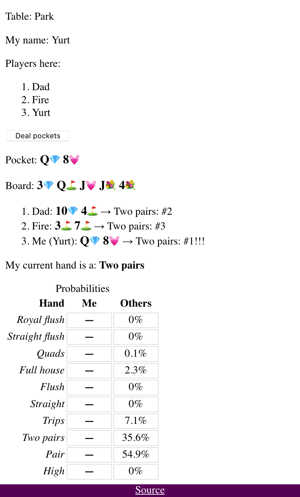

[Aaron Brown](https://www.eraider.com/), a poker–Wall Street type, in his 2006 *The Poker Face of Wall Street*, quotes John Aglialoro (a fellow poker–Wall Street type) who reminisced about learning poker from his grandmother: "He recalls losing the first time he played her, and expecting her to give the money back. She didn’t… Good poker players learn how to make the tough folds and when to pay to see more cards" (page 175). Brown's book emphasizes this notion of having to pay for *information* and for *mistakes*, and it convinced me of the benefits of (1) learning about risk, and (2) using poker as a vehicle to do so.

But it wasn't until I had kids and a relative got us the [Dragonwood](https://gamewright.com/product/dragonwood) boardgame that I saw how natural a process this could be.

In Dragonwood, you assemble groups of warriors to attack marks. These marks have adorable names like "Gooey Glob" and "Giggling Goblin" but more to the point, each has a number of hits to take it down and each warrior gets a dice. So the question naturally arises—if we're rolling three of these weird 1-2-2-3-3-4 dice to attack a monster with nine hitpoints, how lucky do we have to be?

Some frustration with [AnyDice](https://anydice.com/), and some unreadable [code](https://github.com/fasiha/dragonwood-tm-rolls/) later, I printed out a one-page table of dice–hits probabilities.

The first marvel was, folding a Letter-size paper in half twice perfectly fit in the Dragonwood box—but now I reflect that they probably designed it that way.

The bigger marvel was, within a day or two, watching the six-and-a-half-year-old search for the folded up piece of paper in the box, consult it, and modify the attack strategy accordingly.

And the biggest marvel was the new vocabulary that emerged within a few weeks—"Daddy, I think there's three-point-two percent probability of you saying yes to this but (insert request here)". Purely through play, the little monster-hunter had become quite conversant in odds.

Time revealed a limitation to Dragonwood's didactic potential—it was too easy in the game to just wait for more cards to strengthen your band of warriors. We rarely took tough odds because they could just wait a turn or three and convert a 37% to a 64%. At most, you'd repeat a low-probability attack two or three times and take the gentle penalty for temporary failure.

So we eventually realized that the next step had to be poker. I dusted off some code for Texas hold 'em hand analysis, wrapped it up as a web application (Node.js, TypeScript, Socket.io, React, MobX, if those mean something to you), and made [*Call Faye*](https://callfaye.glitch.me). Here's what it looks like on a phone:

It's not an online Texas hold 'em game server. We sit around the table, with piles of pennies or chocolate chips in front of us, but instead of cards, we holding a phone. The app needs you to track bets and folds in meatspace—it just handles cards and probabilities.

The first column of numbers are the probability you'll end up with a high card, a pair, two pairs, etc. The other column is the probability of someone *else* at the table getting a high card, a pair, etc.

In the example above, I see that while my own probability of two pairs is just 8%, an opponent has a 20% chance of having them. I'm probably not going to win this round. But the river delivered! I ended the hand with a two-pair but astonishingly, so did my two opponents:

In the end of the turn, the table just shows what odds any opponent had given the board (and your pocket cards).

So *Call Faye* does the same thing as the page of numbers did for Dragonwood, except for hold 'em.

Go [check it out](https://callfaye.glitch.me). Grab some family members, pick a table name for yourselves and get everyone to type it in, and start playing. Let's learn risk, kids and grownups!

> By the way, I picked ⛳️💎💓💐 to represent club, diamond, heart, and spade because clubs remind me of golf and spades of gardening. And. The app is named after the great seventy-seven-year-old gambler Faye Valentine, and the "Call Me Call Me" song on the *Cowboy Bebop* soundtrack.

(Banner image: a crop from Johannes Vingboons, *Gezicht op Nieuw Amsterdam* (View of New Amsterdam), 1664. [Wikimedia](https://commons.wikimedia.org/wiki/File:GezichtOpNieuwAmsterdam.jpg))